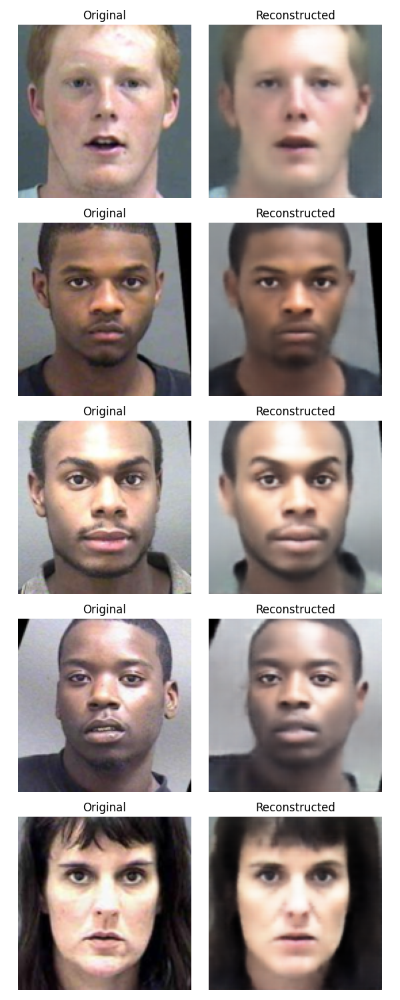
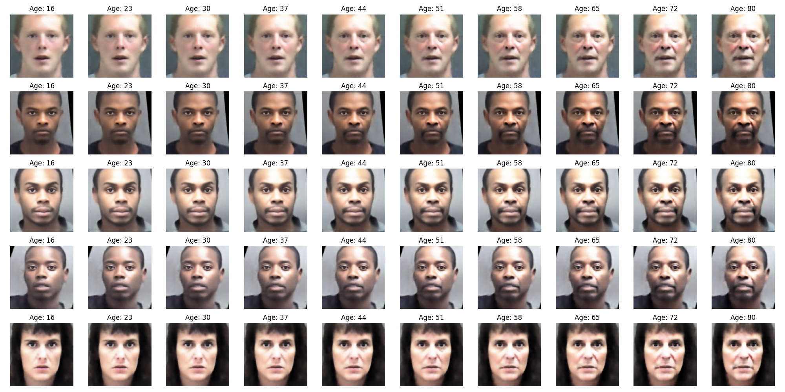
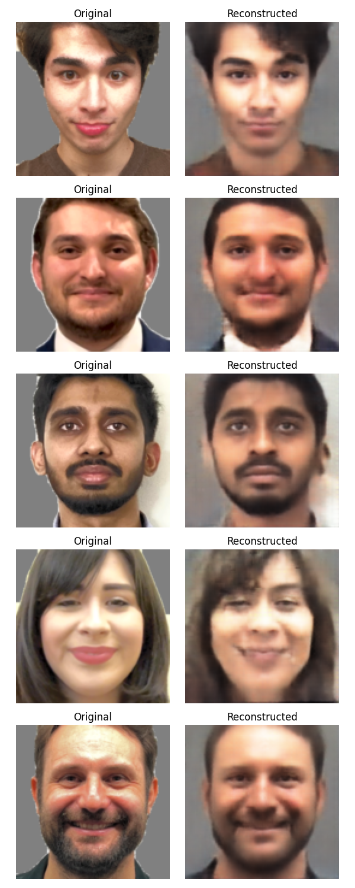
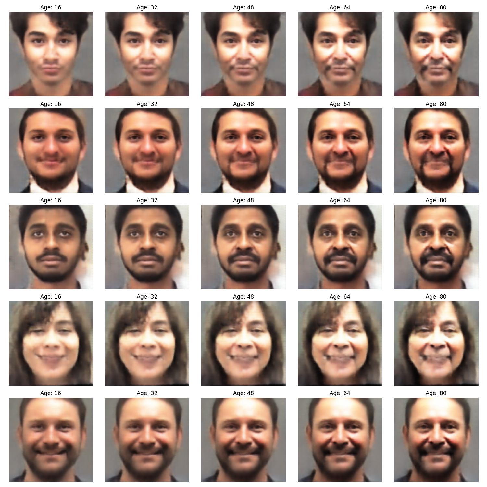

# Age-Conditioned Representation Learning with Conditional VAE

Our goal was to disentangle latent age factors in face images to enable controlled age manipulation. We implemented a Conditional Variational Autoencoder (Conditional VAE), leveraging age and gender conditions within our model to generate realistic and controllable age transformations.

## Dataset:
Morph-2 Dataset.
Kurt Ricanek, and Tesfaye Tessema. (2023). MORPH-2 [Data set]. Kaggle. https://doi.org/10.34740/KAGGLE/DS/3576052

## Methodology: β-VAE Implementation

### CVAE Architecture

Our Conditional VAE architecture consists of a CNN-based encoder that encodes face images and conditioning attributes (age and gender) into a latent space representation. A corresponding decoder reconstructs the images, conditioned on the latent representation and attributes, enabling effective attribute disentanglement and manipulation.

### Loss Functions

The training process utilized reconstruction loss (Mean Squared Error - MSE) and KL divergence loss to achieve image fidelity and latent space regularization.

## Model Training and Baseline Comparison

Data was preprocessed with:

- Image resizing to 128x128 pixels

- Normalization of pixel values

### 1. Training from Scratch

We trained the Conditional VAE from scratch using PyTorch. The model was optimized using the Adam optimizer with a learning rate of 0.0008 for 500 epochs. Training was performed on the Apple MPS backend (ARM-based MacBook Pro), ensuring efficient utilization of hardware resources.

### 2. Architecture Inspiration

While training from scratch, we referenced architectures such as ResNet-like CNNs to inform our design for efficient feature extraction. These architectures provided a solid foundation for building an effective encoder and decoder.

### 3. Baseline Comparison

To benchmark our progress, we planned to compare our results against a pre-trained VAE model sourced from repositories like TensorFlow Model Garden or PapersWithCode. This comparison was intended to provide a quantitative measure of the improvements achieved through our β-VAE implementation and age-conditioned training approach.

## _Data Preparation_

### 1. MorphII Dataset

We utilized the MorphII dataset, consisting of around 500,000 labeled face images from IMDb and Wikipedia. This dataset provided a rich source of data for training our model, including metadata such as age, gender, and timestamps.

### 2. Addressing Data Imbalance

Recognizing the dataset’s inherent imbalances (fewer samples for older individuals), we implemented several preprocessing steps to improve training quality and ensure fair representation across age ranges.

## _Data Preprocessing Challenges and Solutions_

One of the most time-consuming and technically challenging aspects of our project was ensuring consistency in image backgrounds, framing, and lighting. Without addressing these factors, the model struggled to learn a clean latent representation of age, as variations in background color, head positioning, and brightness introduced unwanted noise.

### Challenges Faced

### 1.	Background Inconsistency: 

Images in our dataset had highly varied backgrounds, ranging from plain walls to complex, multicolored environments. This made it difficult for the model to focus on facial features rather than irrelevant background information.

### 2.	Framing and Alignment Issues: 

Face images were not consistently aligned, with variations in head tilt, positioning, and scale affecting training quality. Without proper alignment, the model had difficulty learning smooth age transformations.

### 3.	Lighting Variability: 

Different images had different exposure levels, making it harder for the model to generalize across lighting conditions.

## Evaluation Metrics and Performance Assessment

### Reconstruction Accuracy

We assessed the model’s performance using reconstruction accuracy, measured by MSE (Mean Squared Error) or L1 loss. This metric provided insight into how well the model could reconstruct input images after encoding and decoding.

### Latent Space Disentanglement

To quantify the disentanglement of the latent space, we employed metrics such as Mutual Information Gap (MIG). This metric helped us understand the extent to which individual latent variables captured distinct factors of variation (e.g., age).

### Age Shift Vector Application

We applied age shift vectors to test the model’s interpolation capabilities. By manipulating the latent representation, we evaluated how smoothly and realistically the model could transition between different ages.

## Key Challenges and Solutions

### Dataset Imbalance

The IMDB-Wiki dataset had a notable age imbalance, with fewer samples for older individuals, potentially skewing the model’s learning. To mitigate this, we employed data augmentation techniques and weighted loss functions to ensure fairer representation across all age ranges.

### Disentanglement Complexity

Achieving effective disentanglement of age from other facial features proved challenging. Tuning the β hyperparameter in the β-VAE was crucial. We conducted extensive experiments to find an optimal value that balanced reconstruction quality and disentanglement performance.

## Results: Age Transformation Simulation

### Aging Simulation

Our age transformation simulation demonstrated the model’s ability to realistically age faces. By manipulating the age shift vector in latent space, we generated plausible aging effects while preserving the individual’s identity.

## Conclusion and Future Directions

## Summary of Work

We successfully implemented an age-conditioned β-VAE for disentangling latent age factors in face images. We addressed data imbalance, optimized the model architecture, and achieved realistic age transformation simulations.

## Key Findings

Our work highlights the effectiveness of β-VAEs for controlled attribute manipulation in facial images. The age-conditioned loss function and careful hyperparameter tuning were crucial for achieving high-quality results.

## Future Work

Future directions include exploring more advanced disentanglement techniques, incorporating additional facial attributes, and applying the model to other image datasets.

